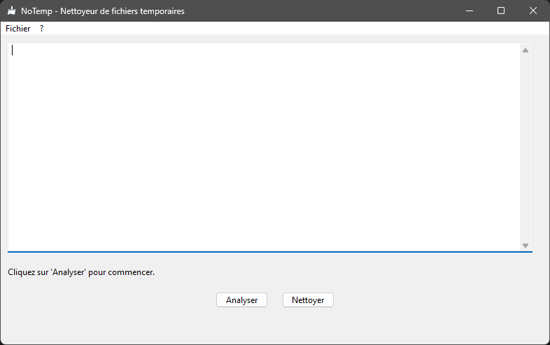

# NoTemp - Nettoyeur de fichiers temporaires

 

**NoTemp** est un utilitaire simple et efficace permettant de rechercher et supprimer les fichiers temporaires sur Windows. Il détecte et nettoie les fichiers inutiles présents dans les répertoires système afin de libérer de l'espace disque et améliorer les performances du système.

## Fonctionnalités

- **Analyse approfondie** des fichiers temporaires dans :
  - `%TEMP%`
  - `C:\Users\%USERNAME%\AppData\Local\Temp`
  - `C:\Windows\Temp`
- **Suppression sécurisée** des fichiers temporaires.
- **Rapports détaillés** enregistrés dans `AppData\Local\NoTemp\log`.
- **Interface utilisateur moderne** avec `wxPython`.
- **Exécution en mode administrateur** pour assurer la suppression des fichiers verrouillés.
- **Menu interactif** permettant d'accéder aux rapports générés.

## Captures d'écran

## Téléchargement

Vous pouvez télécharger l'application en cliquant sur le lien ci-dessous :

[➡ Télécharger NoTemp.exe](https://github.com/votre-utilisateur/NoTemp/releases/latest)

> **Remarque :** Le programme s'exécute en tant qu'administrateur pour supprimer les fichiers temporaires système.

## Installation

### Prérequis

- Windows 10/11
- Python 3.8 ou version ultérieure (si utilisation du script Python)

## Problèmes connus

- Certains fichiers peuvent ne pas être supprimés s'ils sont utilisés par des processus système.
- Nécessite les droits d'administrateur pour exécuter la suppression.
